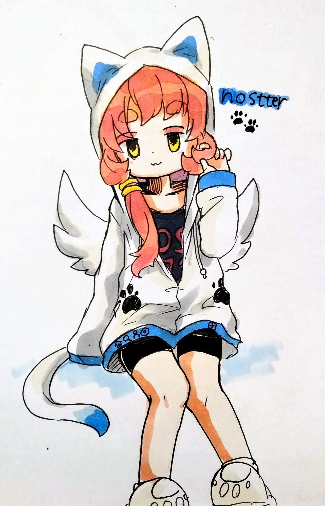

<div align="center">
  
</div>
<br>
<p align="center">
  Nostr client for web.<br>
  <a href="https://nostter.app/home" target="_blank">https://nostter.app/</a>
</p>

## How to login

- [NIP-07](https://github.com/nostr-protocol/nips/blob/master/07.md#implementation) browser extensions (recommended)
- `nsec`
- `npub` for readonly

## Share on nostter

Link to

```
https://nostter.app/post?content={url-encoded-text-here}
```

<details>
<summary>Bookmarklet</summary>

```js
javascript:window.open(`https://nostter.app/post?content=${document.title}%20${location.href}`);
```

</details>

## Dependencies

| Category | Names |
| - | - |
| Nostr | [Nostr](https://github.com/nostr-protocol/nostr), [nostr-tools](https://github.com/nbd-wtf/nostr-tools), [rx-nostr](https://github.com/penpenpng/rx-nostr), [nip07-awaiter](https://github.com/penpenpng/nip07-awaiter) |
| Frameworks | Svelte, SvelteKit, Vite |
| Languages | TypeScript, JavaScript, Node.js |
| Tests | Vitest, Playwright |
| UI | [Tabler Icons for Svelte](https://tabler.io/docs/icons/svelte), [emoji-kitchen-mart](https://www.npmjs.com/package/emoji-kitchen-mart) |

See full list at [package.json](web/package.json)

## Contribution

Welcome issues, pull requests and discussions.

## Special Thanks

UI by [@kaiji](https://nostter.app/npub194qhhn5vzzyrsqaugfms8c7ycqjyvhyguurra450nhlweatfzxkqy8tgkd)

Logo by [@apco](https://nostter.app/npub1njty7prjt49kju6c3mjjlxvm0hjymf5s2qlfcyjqg5e0k8kftp3s4dpsn5)

Illustration by [@stok33](https://nostter.app/npub1e09suzmq9mp6nt0ud9ttl03790qjx70wzwlc2pwwghcusvwju54qs0c800)


